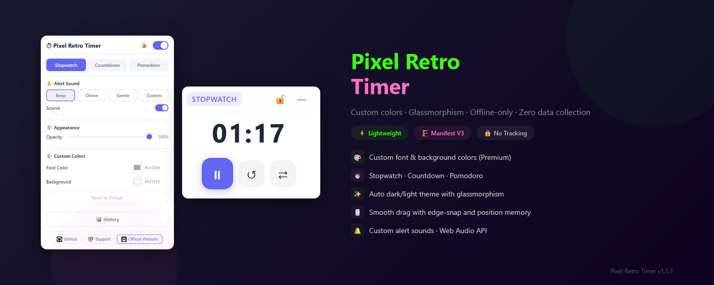

# Pixel Retro Timer

[English](README.md) | [中文](languages/README_zh.md) | [Español](languages/README_es.md) | [Deutsch](languages/README_de.md) | [日本語](languages/README_ja.md) | [Français](languages/README_fr.md)

A retro-styled floating timer extension with 4 skins, dynamic effects, stopwatch/countdown/pomodoro modes. fully offline, zero data collection.

> Chromium-based · Manifest V3 · No tracking · Offline-only · 4 skins

---

## Features

| Feature | Description |
|---------|-------------|
| 🕹️ **4 Retro Skins** | Pixel Arcade, Cream Kawaii, Neon Cyber, Minimal Film |
| ⏱️ **Triple Timer Modes** | Stopwatch, custom countdown, Pomodoro (25+5) |
| 🖱️ **Drag & Snap** | Smooth drag with edge-snapping, position memory |
| ✨ **Dynamic Effects** | Skin-specific animations: pixel flicker, neon glow, cream bounce, film grain |
| 🔔 **Offline Sound** | Retro electronic beep generated via Web Audio API |
| 🎚️ **Opacity Control** | 20%-100% transparency slider |
| 🔒 **Lock & Minimize** | Lock position to prevent accidental drag |
| ⏱️ **Quick Presets** | 10/25/30/60 min one-tap countdown |
| 🌍 **Multi-Language** | EN, ZH, JA, DE, ES, FR |
| 🛡️ **Zero Permissions** | Only `activeTab` + `storage` |

---

## Preview

  

---

## Supported Browsers

| Browser | Status |
|---------|--------|
| Google Chrome | ✅ Fully supported |
| Microsoft Edge | ✅ Fully supported |
| Other Chromium-based browsers | ✅ Should work |

---

## Installation

1. Open `chrome://extensions/` or `edge://extensions/`
2. Enable **Developer mode**
3. Click **Load unpacked** and select the project folder
4. Click the timer icon in your toolbar

---

## Usage

1. **Click the extension icon** to open settings
2. **Choose a skin** — Pixel, Cream, Neon, or Film
3. **Select mode** — Stopwatch, Countdown, or Pomodoro
4. **The timer widget** appears on the page — drag it anywhere
5. **▶ Start / ⏸ Pause / ↺ Reset** — control buttons on the widget
6. **⇄ Switch mode** — cycle through modes on the widget
7. **🔒 Lock** — prevent accidental dragging
8. **— Minimize** — collapse to title bar only

---

## Skins

| Skin | Style | Effects |
|------|-------|---------|
| 🕹️ **Pixel** | Retro arcade, green-on-dark | Pixel flicker, glow border |
| 🍦 **Cream** | Kawaii pastel, soft pink | Gentle bounce, soft shadows |
| 💜 **Neon** | Cyberpunk, neon pink-on-dark | Glow pulse, neon border |
| 🎞️ **Film** | Vintage film grain, warm tones | Film shake, subtle grain |

---

## Privacy

- Only `activeTab` + `storage` permissions
- `activeTab`: Access when user clicks the extension icon
- `storage`: Save skin preference, window position, timer settings locally
- No network requests — fully offline
- No browsing history access, no tracking, no data upload
- Sound effects generated in-browser via Web Audio API
- [Privacy Policy](privacy-policy.html)

---

## Copyright Disclaimer

This extension provides a local floating timer overlay for user convenience. It does not modify, copy, or redistribute any website content. Users shall comply with local laws when using this extension.

---

## License

Copyright © 2026 Pixel Retro Timer. All rights reserved.
